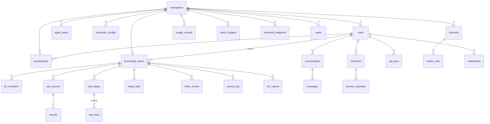

# 数据模型设计：Terrane 个人知识库平台

状态：**v1.1 定稿**（2026-06-13，终审 28 项修订后定稿——用户授权"按照你的理解来"） ｜ 依据：PRD v1.0.3 §7 + 01-system.md ｜ 引擎：PostgreSQL 18 + AGE 1.7.0 + pgvector + zhparser（版本锁定，.agent.md §1）

**全局约定**：
- 主键 `id uuid PRIMARY KEY DEFAULT uuidv7()`（PG18 原生）
- 三时间戳 `created_at / updated_at timestamptz NOT NULL DEFAULT now()`，**无 `deleted_at`**——硬删除铁律（PRD §7）：删除 = 真删 + FK 级联；唯二例外 = `audit_logs`（append-only 不可删）与 License 吊销存根（CRL，Forge 侧）
- 业务表全部带 `workspace_id uuid NOT NULL REFERENCES workspaces(id) ON DELETE CASCADE`，ORM 四层强制租户过滤
- 知识域表额外带 `kb_id`，级联自 `knowledge_bases`
- 字段加密：标注 `[L5-ENC]` 的列存 envelope-encrypted 密文（AES-256-GCM，主密钥 env 注入）

---

## 1. ER 图（主干）


（AGE 图实体/关系不在 ER 图内，见 §4。）

## 2. 实体清单

| 表 | 用途 | WS 隔离 | 硬删级联源 | 关键索引/约束 |
|----|------|---------|-----------|--------------|
| `workspaces` | 租户 | — | 自身=级联根 | slug UNIQUE |
| `users` | 用户 | ✅ | workspace | (workspace_id,email) UNIQUE |
| `memberships` | WS 角色 | ✅ | user/workspace | (workspace_id,user_id) UNIQUE |
| `knowledge_bases` | 库 | ✅ | workspace | (workspace_id,slug) UNIQUE；visibility CHECK |
| `kb_members` | 库级共享角色 | ✅ | kb/user | (kb_id,user_id) UNIQUE |
| `kb_schemas` | 库 Schema 版本链 | ✅ | kb | (kb_id,version) UNIQUE |
| `raw_sources` | 不可变原始源 | ✅ | kb | (kb_id,content_hash)；version_of 自引用 |
| `chunks` | 分块+向量 | ✅ | raw_source | HNSW(embedding halfvec)；GIN(ts) zhparser；(kb_id,chunk_hash) UNIQUE |
| `wiki_pages` | 物化投影页 | ✅ | kb | (kb_id,slug) UNIQUE；entity_ref → AGE |
| `wiki_page_revisions` | 页面历史 | ✅ | wiki_page | (page_id,rev) UNIQUE |
| `wiki_links` | 双向链接（边投影缓存） | ✅ | from/to page | (kb_id,to_page_id) 反链查询 |
| `index_entries` | 库索引（index 页数据） | ✅ | kb | (kb_id,entry_type) |
| `activity_log` | 库日志 append-only | ✅ | kb | BRIN(created_at)；按月分区 |
| `ingest_jobs` | 摄入任务+token 账单 | ✅ | kb | (kb_id,status)；(status,created_at) 队列扫描 |
| `lint_reports` | 体检报告 | ✅ | kb | (kb_id,created_at DESC) |
| `lint_items` | 修复项子表（可寻址:fix） | ✅ | lint_report | (report_id,status) |
| `audio_overviews` | 音频概览任务（脚本草稿/状态/产物/账单） | ✅ | kb | (kb_id,status) |
| `workspace_quotas` | 配额三类型配置+计量值（存储字节=对象存储用量+PG 表大小日刷；token 降级阈值） | ✅ | workspace | (workspace_id) UNIQUE |
| `export_jobs` | 导出任务（状态+产物指针） | ✅ | kb | (kb_id,created_at DESC) |
| `product_events` | 本地埋点（onboarding 四幕/aha 触达，永不外发，保留期走 Retention） | ✅ | workspace | 按月分区 |
| `conversations` / `messages` | 对话/消息（引用指针 jsonb） | ✅ | user / conversation | messages(conversation_id,seq) |
| `memories` | 记忆三类 per-user | ✅ | user | (user_id,kind)；(user_id,updated_at DESC) |
| `memory_episodes` | 时序层 episode 指针 | ✅ | memory | (memory_id,occurred_at) |
| `agent_tasks` / `agent_runs` | Agent 定义/运行历史 | ✅ | workspace / task | (workspace_id,schedule_next_at) 调度扫描 |
| `api_keys` | Key+scope+限速 | ✅ | user | key_hash UNIQUE；last_used_at |
| `mcp_server_configs` | 第三方 MCP client 配置 | ✅ | workspace | — |
| `connector_configs` | 连接器实例+凭据[L5-ENC] | ✅ | workspace | (workspace_id,connector_type) |
| `connector_sync_state` | 同步游标/状态 | ✅ | connector | (connector_id) UNIQUE |
| `channels` | 模型渠道（六路）[L5-ENC key] | ✅ | workspace | (workspace_id,name) UNIQUE |
| `model_roles` | 角色路由（chat/extract/embed/…） | ✅ | workspace | (workspace_id,role) UNIQUE |
| `usage_records` | 逐请求计量 append-only | ✅ | workspace | 按月分区；(workspace_id,kb_id,created_at) |
| `token_budgets` | 月预算+阈值状态 | ✅ | workspace | (workspace_id,kb_id) UNIQUE NULLS NOT DISTINCT |
| `notifications` | 站内通知 | ✅ | user | (user_id,read_at NULLS FIRST,created_at DESC) |
| `webhook_endpoints` / `webhook_deliveries` | 出站 webhook+投递 | ✅ | workspace | deliveries 按月分区 |
| `seats` | 企业 seat 占用 | ✅ | workspace | (workspace_id,user_id) UNIQUE |
| `license_state` | 激活状态缓存（权威在 verifier） | — | 例外：吊销存根反范式保留 | 单行表 |
| `audit_logs` | 审计 append-only ≥1 年 | ✅ | **不级联不可删**（铁律例外） | 按月分区；(workspace_id,event_type,created_at) |
| `settings` / `branding` / `data_retention_policies` | B 端基线配置 | ✅/全局 | workspace | — |

## 3. 核心表 DDL

```sql
-- 库（含可见性 + git 镜像配置）
CREATE TABLE knowledge_bases (
  id uuid PRIMARY KEY DEFAULT uuidv7(),
  workspace_id uuid NOT NULL REFERENCES workspaces(id) ON DELETE CASCADE,
  owner_id uuid NOT NULL REFERENCES users(id),          -- owner 转移需双方确认(应用层)
  slug varchar(64) NOT NULL,
  name varchar(255) NOT NULL,
  visibility varchar(16) NOT NULL DEFAULT 'private'
    CHECK (visibility IN ('private','shared','workspace')),
  schema_version int NOT NULL DEFAULT 1,                -- 当前生效 kb_schemas.version
  retrieval_tier varchar(8) NOT NULL DEFAULT 'auto'
    CHECK (retrieval_tier IN ('auto','small','vector')),-- 4.2.3 档位
  chunk_threshold int NOT NULL DEFAULT 50000,
  git_mirror_enabled boolean NOT NULL DEFAULT true,
  age_graph_name varchar(80) NOT NULL,                  -- 'kb_'||replace(id::text,'-','')
  admin_readable boolean NOT NULL DEFAULT false,        -- 企业策略:Admin 可读 private(改配仅未来生效+审计)
  created_at timestamptz NOT NULL DEFAULT now(),
  updated_at timestamptz NOT NULL DEFAULT now(),
  UNIQUE (workspace_id, slug)
);

CREATE TABLE kb_members (
  id uuid PRIMARY KEY DEFAULT uuidv7(),
  workspace_id uuid NOT NULL REFERENCES workspaces(id) ON DELETE CASCADE,
  kb_id uuid NOT NULL REFERENCES knowledge_bases(id) ON DELETE CASCADE,
  user_id uuid NOT NULL REFERENCES users(id) ON DELETE CASCADE,
  role varchar(16) NOT NULL CHECK (role IN ('viewer','editor')),
  invited_by uuid REFERENCES users(id) ON DELETE SET NULL,
  created_at timestamptz NOT NULL DEFAULT now(),
  updated_at timestamptz NOT NULL DEFAULT now(),
  UNIQUE (kb_id, user_id)
);

-- 不可变原始源（修改=新版本追加）
CREATE TABLE raw_sources (
  id uuid PRIMARY KEY DEFAULT uuidv7(),
  workspace_id uuid NOT NULL REFERENCES workspaces(id) ON DELETE CASCADE,
  kb_id uuid NOT NULL REFERENCES knowledge_bases(id) ON DELETE CASCADE,
  source_type varchar(32) NOT NULL,        -- upload/clip/sync/connector/conversation/agent
  origin jsonb NOT NULL DEFAULT '{}',      -- URL/连接器ID/对话ID/untrusted 标记(R10)
  title varchar(512) NOT NULL,
  mime varchar(128),
  object_key varchar(512),                 -- 对象存储指针(原件)
  parsed_object_key varchar(512),          -- 解析产物 Markdown 指针
  content_hash char(64) NOT NULL,          -- sha256,去重
  version_of uuid REFERENCES raw_sources(id) ON DELETE CASCADE,  -- 版本链
  parse_status varchar(16) NOT NULL DEFAULT 'pending'
    CHECK (parse_status IN ('pending','parsing','parsed','degraded','failed')),
  parse_error text,
  untrusted boolean NOT NULL DEFAULT false, -- 外部抓取内容标记,传播至 chunks
  created_at timestamptz NOT NULL DEFAULT now(),
  updated_at timestamptz NOT NULL DEFAULT now()
);
CREATE INDEX idx_raw_sources_kb_hash ON raw_sources (kb_id, content_hash);

-- 分块（向量+全文同表,单库原则）
CREATE TABLE chunks (
  id uuid PRIMARY KEY DEFAULT uuidv7(),
  workspace_id uuid NOT NULL REFERENCES workspaces(id) ON DELETE CASCADE,
  kb_id uuid NOT NULL REFERENCES knowledge_bases(id) ON DELETE CASCADE,
  raw_source_id uuid NOT NULL REFERENCES raw_sources(id) ON DELETE CASCADE,
  seq int NOT NULL,
  content text NOT NULL,
  context_prefix text,                     -- contextual retrieval 前缀(GPU/外接档)
  chunk_hash char(64) NOT NULL,
  embedding halfvec(1024),                 -- Qwen3-Embedding-0.6B;企业档 MRL 统一 1024 维
  ts tsvector,                             -- zhparser+english 双配置合并
  locator jsonb NOT NULL DEFAULT '{}',     -- 页码/标题路径/时间戳(引用定位)
  untrusted boolean NOT NULL DEFAULT false,
  created_at timestamptz NOT NULL DEFAULT now(),
  updated_at timestamptz NOT NULL DEFAULT now(),
  UNIQUE (kb_id, chunk_hash)
);
-- 多源同内容：ON CONFLICT (kb_id,chunk_hash) DO UPDATE 将新源追加进 locator.sources[]（数组），
-- 引用定位展示全部来源；raw_source_id 保留首源（C4 归属策略）
CREATE INDEX idx_chunks_hnsw ON chunks USING hnsw (embedding halfvec_cosine_ops)
  WITH (m=16, ef_construction=64);         -- 构建走低峰队列(R12)
CREATE INDEX idx_chunks_ts ON chunks USING gin (ts);
CREATE INDEX idx_chunks_kb_source ON chunks (kb_id, raw_source_id, seq);

-- wiki 物化投影页
CREATE TABLE wiki_pages (
  id uuid PRIMARY KEY DEFAULT uuidv7(),
  workspace_id uuid NOT NULL REFERENCES workspaces(id) ON DELETE CASCADE,
  kb_id uuid NOT NULL REFERENCES knowledge_bases(id) ON DELETE CASCADE,
  slug varchar(255) NOT NULL,
  page_type varchar(16) NOT NULL
    CHECK (page_type IN ('summary','entity','concept','compare','survey','index','log')),
  title varchar(512) NOT NULL,
  frontmatter jsonb NOT NULL DEFAULT '{}',
  body_md text NOT NULL,                   -- 物化正文(权威源=AGE,本列为投影)
  entity_ref varchar(255),                 -- AGE 节点 entity_id(entity/concept 页)
  takeover boolean NOT NULL DEFAULT false, -- 接管编辑态
  rev int NOT NULL DEFAULT 1,
  rendered_at timestamptz NOT NULL DEFAULT now(),  -- 投影时间(滞后监控)
  created_at timestamptz NOT NULL DEFAULT now(),
  updated_at timestamptz NOT NULL DEFAULT now(),
  UNIQUE (kb_id, slug)
);
CREATE INDEX idx_wiki_pages_entity_ref ON wiki_pages (kb_id, entity_ref)
  WHERE entity_ref IS NOT NULL;   -- 图变更→受影响页反查（投影最热路径，C1）
-- wiki_page_revisions: (page_id, rev, body_md, frontmatter, edited_by nullable, diff_meta jsonb)

-- 摄入任务（含估价与账单）
CREATE TABLE ingest_jobs (
  id uuid PRIMARY KEY DEFAULT uuidv7(),
  workspace_id uuid NOT NULL REFERENCES workspaces(id) ON DELETE CASCADE,
  kb_id uuid NOT NULL REFERENCES knowledge_bases(id) ON DELETE CASCADE,
  raw_source_id uuid REFERENCES raw_sources(id) ON DELETE CASCADE,
  mode varchar(16) NOT NULL DEFAULT 'supervised' CHECK (mode IN ('supervised','batch')),
  status varchar(16) NOT NULL DEFAULT 'queued'
    CHECK (status IN ('queued','parsing','chunking','embedding','graphing','projecting','done','failed')),
  est_tokens bigint,                        -- 摄入前估价
  spent_tokens bigint NOT NULL DEFAULT 0,   -- 实耗(usage_records 汇总)
  stage_detail jsonb NOT NULL DEFAULT '{}',
  error text,
  created_at timestamptz NOT NULL DEFAULT now(),
  updated_at timestamptz NOT NULL DEFAULT now()
);

-- 记忆（per-user 铁律）
CREATE TABLE memories (
  id uuid PRIMARY KEY DEFAULT uuidv7(),
  workspace_id uuid NOT NULL REFERENCES workspaces(id) ON DELETE CASCADE,
  user_id uuid NOT NULL REFERENCES users(id) ON DELETE CASCADE,   -- 永不跨用户
  kind varchar(16) NOT NULL CHECK (kind IN ('semantic','episodic','procedural')),
  content text NOT NULL,
  confidence real NOT NULL DEFAULT 0.8,
  pinned boolean NOT NULL DEFAULT false,
  decay_score real NOT NULL DEFAULT 1.0,    -- 衰减,整理任务更新
  source_conversation_id uuid REFERENCES conversations(id) ON DELETE SET NULL,
  -- 时序层开关 = 用户级（memory settings，user_settings.memory_temporal_enabled），无行级/库级 flag
  -- （口径修正：PRD 4.6.3 原文"库设置"与 per-user 模型矛盾，定为用户级，偏差记录于此）
  created_at timestamptz NOT NULL DEFAULT now(),
  updated_at timestamptz NOT NULL DEFAULT now()
);
-- memory_episodes: (memory_id FK CASCADE, occurred_at, conversation_ref, raw_excerpt)
-- 时序边(t_valid/t_invalid)在 AGE 记忆图中,见 §4.2;用户删除记忆→本表硬删+AGE 节点边硬删

-- 逐请求计量（append-only,按月分区）
CREATE TABLE usage_records (
  id uuid NOT NULL DEFAULT uuidv7(),
  workspace_id uuid NOT NULL,
  kb_id uuid,
  user_id uuid,
  role varchar(24) NOT NULL,               -- chat/extract/embed/rerank/transcribe/tts/vision/council
  channel_id uuid,
  model varchar(128) NOT NULL,
  input_tokens bigint NOT NULL DEFAULT 0,
  output_tokens bigint NOT NULL DEFAULT 0,
  upstream_usage jsonb,                    -- 上游 usage 原文(计量以此为准)
  purpose varchar(24) NOT NULL,            -- chat/ingest/lint/memory/agent/council/audio
  request_id uuid NOT NULL,
  created_at timestamptz NOT NULL DEFAULT now(),
  PRIMARY KEY (id, created_at)
) PARTITION BY RANGE (created_at);         -- 月分区,保留期按 Data Retention 策略

-- 月预算闸门
CREATE TABLE token_budgets (
  id uuid PRIMARY KEY DEFAULT uuidv7(),
  workspace_id uuid NOT NULL REFERENCES workspaces(id) ON DELETE CASCADE,
  kb_id uuid REFERENCES knowledge_bases(id) ON DELETE CASCADE,  -- NULL=WS 级
  monthly_limit bigint NOT NULL,
  spent bigint NOT NULL DEFAULT 0,          -- scheduler 自然月(部署时区)重置
  state varchar(12) NOT NULL DEFAULT 'ok' CHECK (state IN ('ok','warn80','exhausted')),
  auto_tasks_paused boolean NOT NULL DEFAULT false,  -- 重置时自动恢复+通知
  created_at timestamptz NOT NULL DEFAULT now(),
  updated_at timestamptz NOT NULL DEFAULT now(),
  UNIQUE NULLS NOT DISTINCT (workspace_id, kb_id)
);

-- API Key
CREATE TABLE api_keys (
  id uuid PRIMARY KEY DEFAULT uuidv7(),
  workspace_id uuid NOT NULL REFERENCES workspaces(id) ON DELETE CASCADE,
  user_id uuid NOT NULL REFERENCES users(id) ON DELETE CASCADE,
  name varchar(128) NOT NULL,
  key_hash char(64) NOT NULL UNIQUE,        -- sha256,明文仅创建时返回一次
  key_prefix char(8) NOT NULL,              -- 'trn_'+4 展示用
  scopes varchar(16)[] NOT NULL,            -- {search_read,ingest_write,memory_rw,admin}
  rate_limit_rpm int NOT NULL DEFAULT 60,
  last_used_at timestamptz,
  created_at timestamptz NOT NULL DEFAULT now(),
  updated_at timestamptz NOT NULL DEFAULT now()
);
```
（users/memberships/conversations/messages/agent_tasks/notifications/webhook_* /channels/model_roles/connector_* /settings 等按 b2b 基线与上表约定同构，DDL 在 migration 中给全。）

### 3.1 kb_schemas.schema_json 结构（库宪法契约，B2 收口）

```jsonc
{
  "entity_types": ["person","concept","product","event","place","org"],  // 抽取白名单（出厂默认 6 类）
  "page_templates": {"entity":"...","concept":"...","survey":"..."},      // 页面模板（Markdown 骨架）
  "retrieval": {"weights":{"vector":1.0,"lexical":1.0,"graph":0.8,"timeline":0.5}, "rrf_k":60},
  "agent": {"allowed_hosts":[], "max_steps":20},                          // 域名白名单（4.7.3）
  "memory": {"recall_threshold":0.75, "recall_daily_limit":3},
  "ingest": {"chunk_tokens":512, "overlap_ratio":0.15, "gleaning":1},
  "lint": {"cron":"0 8 * * 1"}
}
```
出厂模板：上述默认值即「通用知识库」模板；另出厂「研究文献」「读书笔记」「项目资料」三个预设（差异仅 entity_types/页面模板），Pydantic+Zod 双侧校验同一 JSON Schema。

## 4. AGE 图 schema（权威源）

### 4.1 知识图谱（每库一 graph：`kb_<uuid32>`）
- **节点 label**：`Entity`，属性：`entity_id`(stable key) / `name` / `etype`(Schema 白名单类型) / `summary` / `confidence` / `human_verified`(接管编辑回写标记) / `source_chunk_ids uuid[]`
- **边 label**：`REL`，属性：`rtype` / `weight` / `description` / `confidence` / `human_verified` / `source_chunk_ids`
- 写入走 LightRAG `MERGE (n:Entity {entity_id:...}) SET ...`（AGE 兼容写法，已源码核验）；增量删除 = 受影响子图重算
- **查询纪律**（01-system D-R6）：统一查询层封装，深度上限 3 跳 + 语句超时 5s；超界走 SQL 邻接补齐
- wiki 投影：`Entity` ↔ `wiki_pages.entity_ref`；边 → `[[链接]]` 与 `wiki_links` 缓存表

### 4.2 记忆时序图（每用户一 graph：`mem_<uuid32>`，时序层开启时）
- 节点：`Fact`（`memory_id` 回指 §3 memories）/ `Episode`
- 边：`ASSERTS` 带 **`t_valid timestamptz` / `t_invalid timestamptz NULL`**（双时态自研，PRD 4.6.3）
- 系统矛盾消解 = 旧边 `t_invalid` 置位（不删，未失效约定值 -1 规避 NULL 比较）；**用户删除 = 节点+边硬删**（铁律）——R16 PoC ✅ 全语义验证通过（../poc/poc-results.md）

### 4.3 隔离与删除
- graph 命名空间天然按库/按用户隔离；查询层强制校验 graph 归属
- 库删除 → `drop_graph(kb_…, cascade)` + 关系表级联 + git 镜像删除 commit + 对象存储清理（worker 编排，删除事务日志保审计元数据）
- 用户删除/DSR → `drop_graph(mem_…, cascade)` + memories/episodes/conversations 级联 + git history-rewrite（涉及其编辑的页按 DSR 范围）

## 5. Migration 计划

`000001_extensions`（age/vector/pg_trgm/zhparser + search_path）→ `000002_workspaces_users_memberships` → `000003_b2b_baseline`（settings/branding/notifications/webhooks/audit_logs 分区）→ `000004_license_seats` → `000005_knowledge_bases_kb_members_schemas` → `000006_raw_sources_chunks`（HNSW/GIN）→ `000007_wiki_pages_revisions_links_index_entries` → `000008_ingest_jobs_activity_log` → `000009_conversations_messages` → `000010_memories_episodes` → `000011_agent_tasks_runs` → `000012_api_keys_mcp_configs` → `000013_connectors` → `000014_channels_model_roles` → `000015_usage_records_partitioned_token_budgets` → `000016_lint_reports`。全部含 up+down；AGE graph 创建在应用层（建库时），不进 migration。

## 6. 数据分类（L1-L5）

| 数据 | 等级 | 加密/处理 |
|------|------|----------|
| raw_sources 原件/parsed、chunks.content、wiki_pages.body_md、memories.content、messages | **L4** 用户核心资产 | 传输 TLS；静态=部署指引卷加密；备份 AES-256；DSR 硬删+git rewrite |
| connector_configs.credentials、channels.api_key | **L5** | 字段级 envelope 加密[L5-ENC]；vault 占位符机制（Agent 不可见） |
| usage_records、activity_log、ingest_jobs 账单 | L3 | 保留期走 Data Retention |
| audit_logs | L3 | append-only ≥1 年，仅元数据**不含内容** |
| users（email/argon2id 哈希） | L3/L5(哈希) | 防枚举 |
| settings/branding | L2 | — |

## 7. 性能考虑

- **量级假设**（个人版上限画像）：单库 10 万 chunk × 1024 维 halfvec ≈ 0.2GB 向量 + HNSW ≈ 0.4GB；企业集群百库并存 → HNSW 构建强制低峰队列、`maintenance_work_mem` 调优
- **分区**：usage_records / activity_log / audit_logs / webhook_deliveries 按月 RANGE 分区，BRIN(created_at)
- **连接池分池**（R12）：api 检索池 / api 常规池 / worker 池独立 sizing；CPU 档 PG `shared_buffers ≤ 1GB`
- 检索 SQL 形态：四路 CTE（ts_rank + pgvector cosine + AGE cypher 邻域 + activity 时间线）→ 应用层 RRF（不强求单 SQL，AGE cypher 与 pgvector 可同事务跨 CTE——微软方案已验证）
- HNSW 多库过滤：依赖 pgvector 0.8 迭代索引扫描（kb_id 过滤选择率低时自动迭代加深）；`hnsw.ef_search` 按档位调（默认 40，向量档大库 100）；选择率 <1% 的极端场景回退精确扫描（R12 压测覆盖）
- `wiki_links` 是 AGE 边的反链缓存表（投影时维护），避免反链面板每次走图查询

## 8. 权限矩阵（库级 × Workspace 角色，实际权限=交集）

| 操作 | private(owner) | private(他人) | shared(viewer) | shared(editor) | workspace 库 | WS Admin 追加 |
|------|---------------|--------------|----------------|----------------|--------------|---------------|
| 检索/问答/图谱/页面读 | ✅ | ❌ | ✅ | ✅ | ✅(Reader+) | private 默认❌（admin_readable 策略开启才✅，改配仅未来+审计） |
| 摄入/回填/接管编辑 | ✅ | ❌ | ❌ | ✅ | Editor+ | **❌ 永不**（admin_readable 仅授予读取，写权限不可经策略获得） |
| 库设置/Schema/共享管理 | ✅ | ❌ | ❌ | ❌ | Owner/Admin | 可管理 shared/workspace 库成员 |
| 库删除/owner 转移 | ✅(输名确认) | ❌ | ❌ | ❌ | owner | ❌（不可代删 private） |
| 记忆（面板/检索注入） | 仅本人 user_id | — | — | — | — | ❌ 永不 |
| Lint 报告正文 | ✅ | ❌ | ✅ | ✅ | ✅ | private 仅统计计数 |
| Agent 派活（写 Wiki 层） | ✅ | ❌ | ❌ | ✅ | Editor+ | — |

平台级（后台）：Super Admin / Platform Admin / Auditor 仅触达管理面（渠道/配额/审计/备份状态），**无内容读取面**；Auditor 只读审计。

---

## 历史变更
**[2026-06-13] v1.0 草案**：依据 PRD §7 + 01-system；硬删除铁律全表落地（无 deleted_at）；AGE 双 graph 命名空间设计；权限矩阵补 PRD 4.1.6 承诺。

**[2026-06-13] v1.1 终审修订定稿**：交叉终审 3 阻塞+14 重要全部修复（MCP client 端点与页面/音频概览表与 UI/admin_readable 写扩权矫正/配额表/队列清单/SSE 枚举/对话结束判定/估价口径/唤回流/外部变更检测/web-search 渠道/伴读章节端点/埋点载体/锁定页轮询/Helm PG 自写模板/NetworkPolicy admin-api 放行等）；建议项已并入。
